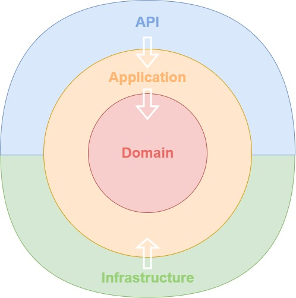
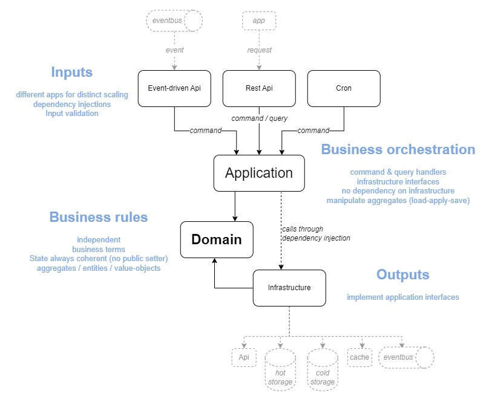

# Customer App

## Purpose

This is an example of DDD-CQRS-Clean based architecture.

Types of routes:
- Authentication
	- Register: allows to create a customer and generate a bearer token. Password is saved hashed and salted (not decryptable).
	- Login: check email and password, generates a bearer token
	- Forgot-password: send an email with reset-password token (see how-to - check mail section)
	- Reset-password: allows to update password with reset-password token
- Customer
	- Get customer information
	- Patch customer: only filled fields will be updated
	- Put password: allows to update password
	- Delete customer
- Stock (concurrent access)
	- Get stocks
	- Add-Items: to increase an item quantity
	- Remove-Items: to decrease an item quantity

### Concurrency

On register, repository check that email does not exist on insert.
On stock management, there is an optimistic update: thanks to saved version, we are able to know if resource has changed and needs a retry

### Architecture details

## How To

### How To - Run locally

- Install Docker Desktop
- Open ./CustomerApp.sln with Visual Studio
- Set "docker-compose" as startup project
- Press F5 to run Solution, a browser with Swagger will open

### How To - Call Customer routes

You must be authenticated to access these routes:
1. Call "register" or "login" to retrieve the customer JWT token
2. Put your token in Authorization header prefixed by "Bearer ". On swagger interface, you can use the Authorize button to do so.

### How To - Open MongoDb admin interface

Local mongo-express is accessible through http://localhost:8081

### How To - Check email

Local SMTP server is accessible through http://localhost:3000

## Next features to be implemented

- Stock: manage idempotent calls (idempotency identifier)
- External API call with circuit breaker example
- Add Unit and Integration Tests (gherkin)