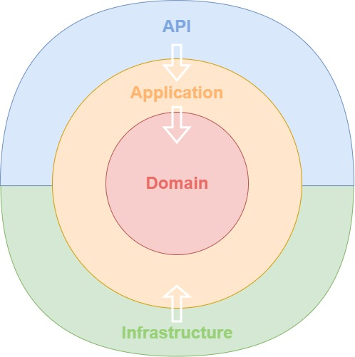

# Customer App

## Purpose

This is an example of DDD-CQRS-Clean based architecture.



## Run locally

- Install Docker Desktop
- Initialize secret locally:
```
 dotnet user-secrets set --project ./CustomerApp.RestApi/ "JwtSettings:Secret" "super-secret-key"
```
- Set "docker-compose" as startup project
- F5 to run

## How to

### Call Customer routes

You must be authenticated to access these routes:
1. Call "register" or "login" to retrieve the customer JWT token
2. Put your token in Authorization header prefixed by "Bearer ". On swagger interface, you can use the Authorize button to do so.

### Check email

Local SMTP server is available on http://localhost:3000

## Next features idea

- Replace InMemoryRepository by local database
- Manage concurrency (optimist update, auto retry)
- Add Unit and Integration Tests
- External API call with circuit breaker example
- Eventbus listener API
